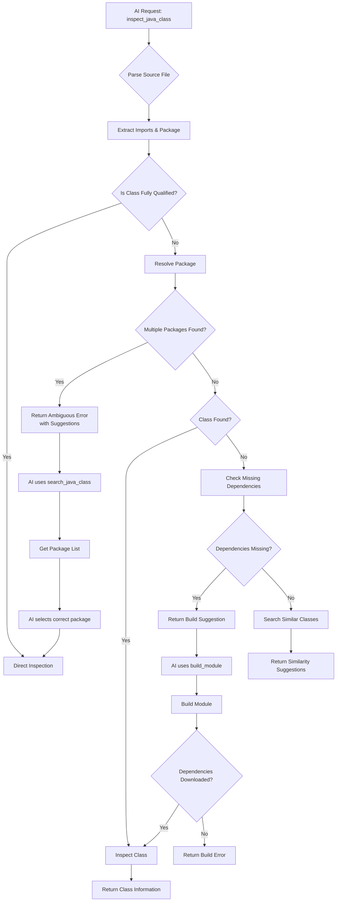

# MCP Server Enhancement: Dependency Management and Class Resolution

## 1. Problem Analysis

### 1.1 Current Issues
1. **Missing Local Dependencies**: Dependencies may not be present in local Maven repository
2. **Class Ambiguity**: AI cannot determine which package a class belongs to based on import statements
3. **Source JAR Unavailability**: Source code may not be available even after building

## 2. Enhanced Architecture Design

### 2.1 New Component Structure
```
io.github.bhxch.mcp.javastub/
├── dependency/                         # New: Dependency management
│   ├── DependencyManager.java
│   ├── MavenBuilder.java
│   ├── DependencyDownloader.java
│   └── SourcePackageResolver.java
├── classpath/                         # Enhanced classpath management
│   ├── ClassIndexer.java
│   ├── PackageMappingResolver.java
│   └── ClassLocationTracker.java
├── intelligence/                       # AI interaction intelligence
│   ├── SuggestionEngine.java
│   ├── ContextAwareResolver.java
│   └── BuildPromptGenerator.java
└── tools/                              # Enhanced tools
    ├── InspectJavaClassTool.java
    ├── ListModuleDependenciesTool.java
    ├── SearchJavaClassTool.java        # New: Search class in packages
    └── BuildModuleTool.java            # New: Build module to get dependencies
```

## 3. Solution 1: Build Prompt System

### 3.1 BuildPromptGenerator.java
```java
package io.github.bhxch.mcp.javastub.intelligence;

/**
 * Generates intelligent prompts for AI to build missing dependencies
 */
public class BuildPromptGenerator {
    
    /**
     * Generate build suggestion when class is not found
     */
    public String generateBuildSuggestion(String className, ModuleContext context, 
                                          List<DependencyInfo> missingDependencies) {
        
        StringBuilder suggestion = new StringBuilder();
        
        // Level 1: Simple missing class
        if (missingDependencies.isEmpty()) {
            suggestion.append("Class '").append(className).append("' is not found in the current module's classpath.\n");
            suggestion.append("This could be because:\n");
            suggestion.append("1. The dependency is missing from local repository\n");
            suggestion.append("2. The module hasn't been built yet\n");
            suggestion.append("3. The class is in a different module\n\n");
            suggestion.append("Please try building the module first:\n");
            suggestion.append("```bash\n");
            suggestion.append(generateMavenBuildCommand(context, false));
            suggestion.append("\n```");
            return suggestion.toString();
        }
        
        // Level 2: Specific dependencies missing
        suggestion.append("The following dependencies required for '").append(className).append("' are missing:\n\n");
        
        for (DependencyInfo dep : missingDependencies) {
            suggestion.append("- ").append(dep.getCoordinates());
            if (dep.getScope() != null) {
                suggestion.append(" (scope: ").append(dep.getScope()).append(")");
            }
            suggestion.append("\n");
        }
        
        suggestion.append("\nTo resolve this, you need to:\n");
        suggestion.append("1. **Build the module** to download dependencies:\n");
        suggestion.append("   ```bash\n");
        suggestion.append("   ").append(generateMavenBuildCommand(context, true));
        suggestion.append("\n   ```\n");
        
        suggestion.append("2. **Or download specific dependencies**:\n");
        suggestion.append("   ```bash\n");
        for (DependencyInfo dep : missingDependencies) {
            suggestion.append("   mvn dependency:get -Dartifact=").append(dep.getCoordinates());
            if (!"jar".equals(dep.getType())) {
                suggestion.append(" -Dpackaging=").append(dep.getType());
            }
            suggestion.append(" -Dtransitive=false\n");
        }
        suggestion.append("   ```\n");
        
        suggestion.append("3. **For source code inspection**, also download sources:\n");
        suggestion.append("   ```bash\n");
        for (DependencyInfo dep : missingDependencies) {
            suggestion.append("   mvn dependency:get -Dartifact=").append(dep.getCoordinates());
            suggestion.append(" -Dclassifier=sources\n");
        }
        suggestion.append("   ```");
        
        return suggestion.toString();
    }
    
    /**
     * Generate Maven build command based on context
     */
    private String generateMavenBuildCommand(ModuleContext context, boolean includeTests) {
        StringBuilder cmd = new StringBuilder("mvn");
        
        // Add module-specific path
        if (!context.getModuleRoot().equals(context.getProjectRoot())) {
            cmd.append(" -pl ").append(context.getModuleRoot().relativize(context.getProjectRoot()));
        }
        
        // Add profiles
        if (!context.getActiveProfiles().isEmpty()) {
            cmd.append(" -P").append(String.join(",", context.getActiveProfiles()));
        }
        
        // Determine goals
        if (context.getScope() == Scope.TEST) {
            cmd.append(" test-compile");
        } else {
            cmd.append(" compile");
            if (!includeTests) {
                cmd.append(" -DskipTests");
            }
        }
        
        return cmd.toString();
    }
    
    /**
     * Generate package search suggestion for ambiguous class
     */
    public String generatePackageSearchSuggestion(String simpleClassName, 
                                                 List<String> possiblePackages) {
        
        StringBuilder suggestion = new StringBuilder();
        
        if (possiblePackages.size() == 1) {
            suggestion.append("Found one possible package for class '").append(simpleClassName).append("':\n");
            suggestion.append("- ").append(possiblePackages.get(0)).append(".").append(simpleClassName).append("\n");
            suggestion.append("You can use the full qualified name in your import statement.");
        } else if (possiblePackages.size() > 1) {
            suggestion.append("Found ").append(possiblePackages.size()).append(" possible packages for class '")
                     .append(simpleClassName).append("':\n\n");
            
            // Group by common prefixes
            Map<String, List<String>> grouped = groupPackagesByPrefix(possiblePackages);
            
            for (Map.Entry<String, List<String>> entry : grouped.entrySet()) {
                suggestion.append("**").append(entry.getKey()).append("**").append(":\n");
                for (String pkg : entry.getValue()) {
                    suggestion.append("  - ").append(pkg).append(".").append(simpleClassName).append("\n");
                }
                suggestion.append("\n");
            }
            
            suggestion.append("To resolve ambiguity, you can:\n");
            suggestion.append("1. Use the full qualified class name\n");
            suggestion.append("2. Check which dependencies provide these classes:\n");
            suggestion.append("   ```bash\n");
            suggestion.append("   mvn dependency:tree | grep -E '");
            for (String pkg : possiblePackages) {
                suggestion.append(pkg).append("|");
            }
            suggestion.deleteCharAt(suggestion.length() - 1); // Remove last |
            suggestion.append("'\n   ```");
        } else {
            suggestion.append("No packages found for class '").append(simpleClassName).append("'.\n");
            suggestion.append("This class might not be in any dependency, or you need to build the project first.");
        }
        
        return suggestion.toString();
    }
}
```

## 4. Solution 2: Class Package Resolution System

### 4.1 PackageMappingResolver.java
```java
package io.github.bhxch.mcp.javastub.classpath;

import java.util.*;
import java.util.concurrent.ConcurrentHashMap;
import java.util.regex.Pattern;
import java.util.stream.Collectors;

/**
 * Resolves which package a class belongs to based on imports and context
 */
public class PackageMappingResolver {
    
    private final Map<String, Set<String>> classToPackages = new ConcurrentHashMap<>();
    private final Map<String, String> packageToDependency = new ConcurrentHashMap<>();
    private final Pattern importPattern = Pattern.compile(
        "^import\\s+(?:static\\s+)?([a-zA-Z_$][a-zA-Z\\d_$]*(?:\\.[a-zA-Z_$][a-zA-Z\\d_$]*)*)\\.([a-zA-Z_$][a-zA-Z\\d_$]*)(?:\\s*;)?$"
    );
    
    /**
     * Build index of all classes in classpath with their packages
     */
    public void buildClassIndex(ModuleContext context) {
        try {
            List<Path> classpath = context.getClasspathJars();
            
            // Use virtual threads for parallel indexing
            try (var executor = Executors.newVirtualThreadPerTaskExecutor()) {
                List<Future<Void>> futures = new ArrayList<>();
                
                for (Path jarPath : classpath) {
                    futures.add(executor.submit(() -> {
                        indexJarFile(jarPath, context);
                        return null;
                    }));
                }
                
                for (Future<Void> future : futures) {
                    future.get();
                }
            }
            
            // Also index source JARs if available
            indexSourcePackages(context.getSourceJars(), context);
            
        } catch (Exception e) {
            throw new RuntimeException("Failed to build class index", e);
        }
    }
    
    /**
     * Index a single JAR file
     */
    private void indexJarFile(Path jarPath, ModuleContext context) {
        try (JarFile jarFile = new JarFile(jarPath.toFile())) {
            Enumeration<JarEntry> entries = jarFile.entries();
            
            while (entries.hasMoreElements()) {
                JarEntry entry = entries.nextElement();
                if (entry.getName().endsWith(".class")) {
                    String className = entry.getName()
                        .replace('/', '.')
                        .replace(".class", "");
                    
                    int lastDot = className.lastIndexOf('.');
                    if (lastDot > 0) {
                        String packageName = className.substring(0, lastDot);
                        String simpleName = className.substring(lastDot + 1);
                        
                        // Store mapping
                        classToPackages.computeIfAbsent(simpleName, k -> ConcurrentHashMap.newKeySet())
                            .add(packageName);
                        
                        // Track which dependency provides this package
                        packageToDependency.put(packageName, 
                            getDependencyForJar(jarPath, context));
                    }
                }
            }
        } catch (IOException e) {
            // Log and continue with other JARs
            System.err.println("Failed to index JAR: " + jarPath + " - " + e.getMessage());
        }
    }
    
    /**
     * Parse import statements from Java source file
     */
    public List<String> parseImportsFromSource(String sourceCode) {
        List<String> imports = new ArrayList<>();
        String[] lines = sourceCode.split("\n");
        
        for (String line : lines) {
            line = line.trim();
            if (line.startsWith("import ")) {
                Matcher matcher = importPattern.matcher(line);
                if (matcher.matches()) {
                    imports.add(matcher.group(1) + "." + matcher.group(2));
                } else {
                    // Handle wildcard imports
                    if (line.endsWith(".*;")) {
                        String packageName = line.substring(7, line.length() - 3);
                        imports.add(packageName + ".*");
                    }
                }
            }
        }
        
        return imports;
    }
    
    /**
     * Resolve class name based on imports and context
     */
    public ClassResolutionResult resolveClassName(String simpleName, 
                                                 List<String> imports, 
                                                 String currentPackage) {
        
        ClassResolutionResult result = new ClassResolutionResult();
        result.setSimpleClassName(simpleName);
        
        // Check if it's a fully qualified name
        if (simpleName.contains(".")) {
            result.setResolvedClassName(simpleName);
            result.setResolutionType(ResolutionType.FULLY_QUALIFIED);
            return result;
        }
        
        // First check: Same package classes
        if (currentPackage != null) {
            String samePackageClass = currentPackage + "." + simpleName;
            if (classToPackages.containsKey(simpleName) && 
                classToPackages.get(simpleName).contains(currentPackage)) {
                result.setResolvedClassName(samePackageClass);
                result.setResolutionType(ResolutionType.SAME_PACKAGE);
                result.addMatchedPackage(currentPackage);
                return result;
            }
        }
        
        // Second check: Explicit imports
        for (String importStmt : imports) {
            if (!importStmt.endsWith(".*")) {
                // Regular import
                if (importStmt.endsWith("." + simpleName)) {
                    result.setResolvedClassName(importStmt);
                    result.setResolutionType(ResolutionType.EXPLICIT_IMPORT);
                    result.addMatchedPackage(importStmt.substring(0, importStmt.lastIndexOf('.')));
                    return result;
                }
            } else {
                // Wildcard import
                String packageName = importStmt.substring(0, importStmt.length() - 2);
                String possibleClass = packageName + "." + simpleName;
                
                Set<String> packages = classToPackages.get(simpleName);
                if (packages != null && packages.contains(packageName)) {
                    result.setResolvedClassName(possibleClass);
                    result.setResolutionType(ResolutionType.WILDCARD_IMPORT);
                    result.addMatchedPackage(packageName);
                    return result;
                }
            }
        }
        
        // Third check: Java.lang package (implicit)
        if (isJavaLangClass(simpleName)) {
            result.setResolvedClassName("java.lang." + simpleName);
            result.setResolutionType(ResolutionType.JAVA_LANG);
            result.addMatchedPackage("java.lang");
            return result;
        }
        
        // Fourth check: All possible packages
        Set<String> packages = classToPackages.get(simpleName);
        if (packages != null && !packages.isEmpty()) {
            result.setResolutionType(ResolutionType.AMBIGUOUS);
            result.setPossiblePackages(new ArrayList<>(packages));
            
            // Try to guess based on common patterns
            String guessedPackage = guessMostLikelyPackage(simpleName, packages, imports);
            if (guessedPackage != null) {
                result.setResolvedClassName(guessedPackage + "." + simpleName);
                result.setConfidence(calculateConfidence(simpleName, guessedPackage, imports));
            }
        } else {
            result.setResolutionType(ResolutionType.NOT_FOUND);
        }
        
        return result;
    }
    
    /**
     * Guess the most likely package based on naming patterns
     */
    private String guessMostLikelyPackage(String simpleName, Set<String> packages, 
                                         List<String> imports) {
        
        // Check if any package matches import patterns
        Map<String, Integer> scores = new HashMap<>();
        
        for (String pkg : packages) {
            int score = 0;
            
            // Score based on package commonality
            if (pkg.startsWith("java.") || pkg.startsWith("javax.")) {
                score += 10;
            }
            
            // Score based on class naming conventions
            if (simpleName.endsWith("Factory") && pkg.contains(".factory")) {
                score += 5;
            } else if (simpleName.endsWith("Service") && pkg.contains(".service")) {
                score += 5;
            } else if (simpleName.endsWith("DAO") && pkg.contains(".dao")) {
                score += 5;
            }
            
            // Score based on import context
            for (String importStmt : imports) {
                if (importStmt.startsWith(pkg.substring(0, Math.min(pkg.length(), 10)))) {
                    score += 3;
                }
            }
            
            scores.put(pkg, score);
        }
        
        return scores.entrySet().stream()
            .max(Map.Entry.comparingByValue())
            .map(Map.Entry::getKey)
            .orElse(null);
    }
    
    /**
     * Check if class is in java.lang package
     */
    private boolean isJavaLangClass(String className) {
        // Common java.lang classes
        Set<String> javaLangClasses = Set.of(
            "String", "Integer", "Long", "Double", "Float", "Boolean",
            "Character", "Byte", "Short", "Void", "Object", "Class",
            "System", "Math", "Runtime", "Thread", "Exception",
            "Error", "Throwable", "Runnable", "Comparable"
        );
        
        return javaLangClasses.contains(className);
    }
    
    /**
     * Get all possible packages for a simple class name
     */
    public List<String> getPossiblePackages(String simpleClassName) {
        Set<String> packages = classToPackages.get(simpleClassName);
        return packages != null ? new ArrayList<>(packages) : List.of();
    }
    
    /**
     * Data class for resolution results
     */
    public static class ClassResolutionResult {
        private String simpleClassName;
        private String resolvedClassName;
        private ResolutionType resolutionType;
        private List<String> possiblePackages = new ArrayList<>();
        private List<String> matchedPackages = new ArrayList<>();
        private double confidence = 0.0;
        
        // Getters and setters
        public enum ResolutionType {
            FULLY_QUALIFIED,
            SAME_PACKAGE,
            EXPLICIT_IMPORT,
            WILDCARD_IMPORT,
            JAVA_LANG,
            AMBIGUOUS,
            NOT_FOUND
        }
    }
}
```

## 5. Solution 3: Enhanced MCP Tools

### 5.1 SearchJavaClassTool.java
```java
package io.github.bhxch.mcp.javastub.tools;

/**
 * Tool to search for classes across packages
 */
public class SearchJavaClassTool implements MCPTool {
    
    private final PackageMappingResolver packageResolver;
    private final DependencyManager dependencyManager;
    
    @Override
    public ToolDefinition getDefinition() {
        return ToolDefinition.builder()
            .name("search_java_class")
            .description("Search for Java classes across packages and dependencies")
            .addParameter("classNamePattern", "string", true, 
                "Class name pattern (supports wildcards: *, ?)")
            .addParameter("sourceFilePath", "string", true, 
                "Source file path for context")
            .addParameter("searchType", "string", false, 
                "Search type: exact, prefix, suffix, contains, wildcard", 
                List.of("exact", "prefix", "suffix", "contains", "wildcard"), 
                "wildcard")
            .addParameter("limit", "integer", false, 
                "Maximum number of results to return", "50")
            .build();
    }
    
    @Override
    public JsonNode execute(JsonNode parameters) {
        try {
            String pattern = parameters.get("classNamePattern").asText();
            Path sourceFilePath = Paths.get(parameters.get("sourceFilePath").asText());
            String searchType = parameters.has("searchType") ? 
                parameters.get("searchType").asText() : "wildcard";
            int limit = parameters.has("limit") ? 
                parameters.get("limit").asInt() : 50;
            
            // Get module context
            ModuleContext context = getModuleContext(sourceFilePath);
            
            // Build class index if not already built
            packageResolver.buildClassIndex(context);
            
            // Search for classes
            List<ClassSearchResult> results = searchClasses(pattern, searchType, limit, context);
            
            // Check for missing dependencies
            List<DependencyInfo> missingDeps = dependencyManager.findMissingDependencies(context);
            
            return buildSearchResponse(results, missingDeps, context);
            
        } catch (Exception e) {
            return buildErrorResponse("SEARCH_FAILED", 
                "Failed to search for classes: " + e.getMessage(), 
                Map.of("pattern", parameters.get("classNamePattern").asText()));
        }
    }
    
    private List<ClassSearchResult> searchClasses(String pattern, String searchType, 
                                                 int limit, ModuleContext context) {
        
        Pattern regexPattern = convertToRegex(pattern, searchType);
        List<ClassSearchResult> results = new ArrayList<>();
        
        // Search in indexed classes
        for (Map.Entry<String, Set<String>> entry : 
             packageResolver.getClassToPackages().entrySet()) {
            
            String className = entry.getKey();
            if (regexPattern.matcher(className).matches()) {
                for (String packageName : entry.getValue()) {
                    ClassSearchResult result = new ClassSearchResult();
                    result.setClassName(packageName + "." + className);
                    result.setSimpleClassName(className);
                    result.setPackageName(packageName);
                    result.setDependency(packageResolver.getDependencyForPackage(packageName));
                    result.setInClasspath(true);
                    
                    // Check if source is available
                    result.setSourceAvailable(
                        dependencyManager.isSourceAvailable(
                            result.getDependency(), context));
                    
                    results.add(result);
                    
                    if (results.size() >= limit) {
                        break;
                    }
                }
            }
            
            if (results.size() >= limit) {
                break;
            }
        }
        
        return results;
    }
    
    private JsonNode buildSearchResponse(List<ClassSearchResult> results, 
                                        List<DependencyInfo> missingDeps,
                                        ModuleContext context) {
        
        ObjectMapper mapper = new ObjectMapper();
        ObjectNode response = mapper.createObjectNode();
        
        // Results array
        ArrayNode resultsArray = mapper.createArrayNode();
        for (ClassSearchResult result : results) {
            ObjectNode resultNode = mapper.createObjectNode();
            resultNode.put("className", result.getClassName());
            resultNode.put("simpleName", result.getSimpleClassName());
            resultNode.put("package", result.getPackageName());
            resultNode.put("dependency", result.getDependency());
            resultNode.put("sourceAvailable", result.isSourceAvailable());
            resultNode.put("inClasspath", result.isInClasspath());
            resultsArray.add(resultNode);
        }
        
        response.set("results", resultsArray);
        response.put("totalResults", results.size());
        
        // Add suggestions if dependencies are missing
        if (!missingDeps.isEmpty()) {
            BuildPromptGenerator generator = new BuildPromptGenerator();
            String suggestion = generator.generateBuildSuggestion(
                results.isEmpty() ? "unknown" : results.get(0).getSimpleClassName(),
                context,
                missingDeps
            );
            
            response.put("suggestion", suggestion);
            response.put("hasMissingDependencies", true);
            
            ArrayNode missingArray = mapper.createArrayNode();
            for (DependencyInfo dep : missingDeps) {
                missingArray.add(dep.getCoordinates());
            }
            response.set("missingDependencies", missingArray);
        } else {
            response.put("hasMissingDependencies", false);
        }
        
        return createSuccessResponse(response);
    }
}
```

### 5.2 BuildModuleTool.java
```java
package io.github.bhxch.mcp.javastub.tools;

/**
 * Tool to build Maven module and download dependencies
 */
public class BuildModuleTool implements MCPTool {
    
    private final MavenBuilder mavenBuilder;
    private final CacheManager cacheManager;
    
    @Override
    public ToolDefinition getDefinition() {
        return ToolDefinition.builder()
            .name("build_module")
            .description("Build Maven module and download missing dependencies")
            .addParameter("sourceFilePath", "string", true, 
                "Source file path for module context")
            .addParameter("goals", "array", false, 
                "Maven goals to execute (default: [\"compile\", \"dependency:resolve\"])")
            .addParameter("downloadSources", "boolean", false, 
                "Whether to download source JARs", "false")
            .addParameter("timeoutSeconds", "integer", false, 
                "Build timeout in seconds", "300")
            .build();
    }
    
    @Override
    public JsonNode execute(JsonNode parameters) {
        try {
            Path sourceFilePath = Paths.get(parameters.get("sourceFilePath").asText());
            List<String> goals = parseGoals(parameters);
            boolean downloadSources = parameters.has("downloadSources") ? 
                parameters.get("downloadSources").asBoolean() : false;
            int timeoutSeconds = parameters.has("timeoutSeconds") ? 
                parameters.get("timeoutSeconds").asInt() : 300;
            
            // Get module context
            ModuleContext context = getModuleContext(sourceFilePath);
            
            // Execute build
            BuildResult result = mavenBuilder.buildModule(context, goals, downloadSources, timeoutSeconds);
            
            // Invalidate cache since classpath may have changed
            cacheManager.invalidateModuleCache(context.getModuleRoot());
            
            return buildBuildResponse(result, context);
            
        } catch (TimeoutException e) {
            return buildErrorResponse("BUILD_TIMEOUT", 
                "Build timed out after " + parameters.get("timeoutSeconds").asInt() + " seconds",
                Map.of("suggestion", "Try building manually with mvn compile"));
        } catch (Exception e) {
            return buildErrorResponse("BUILD_FAILED", 
                "Failed to build module: " + e.getMessage(),
                Map.of("errorDetails", e.toString()));
        }
    }
    
    private JsonNode buildBuildResponse(BuildResult result, ModuleContext context) {
        ObjectMapper mapper = new ObjectMapper();
        ObjectNode response = mapper.createObjectNode();
        
        response.put("success", result.isSuccess());
        response.put("exitCode", result.getExitCode());
        response.put("durationSeconds", result.getDurationSeconds());
        
        // Build output (truncated if too long)
        String output = result.getOutput();
        if (output.length() > 10000) {
            output = output.substring(0, 5000) + 
                    "\n...[truncated]...\n" + 
                    output.substring(output.length() - 5000);
        }
        response.put("output", output);
        
        // Downloaded artifacts
        ArrayNode artifactsArray = mapper.createArrayNode();
        for (ArtifactInfo artifact : result.getDownloadedArtifacts()) {
            ObjectNode artifactNode = mapper.createObjectNode();
            artifactNode.put("coordinates", artifact.getCoordinates());
            artifactNode.put("type", artifact.getType());
            artifactNode.put("sizeBytes", artifact.getSizeBytes());
            artifactNode.put("file", artifact.getFile().toString());
            artifactsArray.add(artifactNode);
        }
        response.set("downloadedArtifacts", artifactsArray);
        
        // Suggestions based on build result
        if (!result.isSuccess()) {
            BuildPromptGenerator generator = new BuildPromptGenerator();
            String suggestion = generator.generateBuildSuggestion(
                "unknown",
                context,
                result.getMissingDependencies()
            );
            response.put("suggestion", suggestion);
            
            // Common error patterns
            if (result.getOutput().contains("Could not resolve dependencies")) {
                response.put("errorType", "DEPENDENCY_RESOLUTION_FAILED");
            } else if (result.getOutput().contains("Compilation failure")) {
                response.put("errorType", "COMPILATION_FAILED");
            } else if (result.getOutput().contains("Connection refused")) {
                response.put("errorType", "NETWORK_ERROR");
                response.put("networkSuggestion", "Check your network connection and Maven repository settings");
            }
        } else {
            response.put("suggestion", 
                "Build completed successfully. You can now inspect classes from the downloaded dependencies.");
        }
        
        return createSuccessResponse(response);
    }
}
```

## 6. Solution 4: Context-Aware Class Inspector

### 6.1 Enhanced InspectJavaClassTool.java
```java
public class InspectJavaClassTool implements MCPTool {
    
    // Existing fields...
    private final PackageMappingResolver packageResolver;
    private final BuildPromptGenerator promptGenerator;
    private final DependencyManager dependencyManager;
    
    @Override
    public JsonNode execute(JsonNode parameters) {
        try {
            String className = parameters.get("className").asText();
            Path sourceFilePath = Paths.get(parameters.get("sourceFilePath").asText());
            
            // Parse source file to get imports and current package
            SourceFileContext sourceContext = parseSourceFile(sourceFilePath);
            
            // Resolve class name if it's not fully qualified
            ClassResolutionResult resolution = packageResolver.resolveClassName(
                className, sourceContext.getImports(), sourceContext.getCurrentPackage());
            
            // Handle different resolution types
            switch (resolution.getResolutionType()) {
                case AMBIGUOUS:
                    return handleAmbiguousClass(resolution, sourceFilePath, parameters);
                    
                case NOT_FOUND:
                    return handleClassNotFound(className, sourceFilePath, sourceContext);
                    
                default:
                    // Use resolved class name
                    return inspectResolvedClass(resolution.getResolvedClassName(), 
                                               sourceFilePath, parameters);
            }
            
        } catch (Exception e) {
            return buildErrorResponse("INSPECTION_FAILED", 
                "Failed to inspect class: " + e.getMessage(), null);
        }
    }
    
    private JsonNode handleAmbiguousClass(ClassResolutionResult resolution, 
                                         Path sourceFilePath,
                                         JsonNode parameters) {
        
        // Get module context
        ModuleContext context = getModuleContext(sourceFilePath);
        
        // Generate helpful suggestion
        String suggestion = promptGenerator.generatePackageSearchSuggestion(
            resolution.getSimpleClassName(),
            resolution.getPossiblePackages()
        );
        
        // Check if dependencies need to be built
        List<DependencyInfo> missingDeps = dependencyManager.findMissingDependencies(context);
        
        ObjectMapper mapper = new ObjectMapper();
        ObjectNode response = mapper.createObjectNode();
        
        response.put("error", "AMBIGUOUS_CLASS_NAME");
        response.put("message", "Multiple packages found for class: " + 
                      resolution.getSimpleClassName());
        response.put("suggestion", suggestion);
        
        // List possible packages
        ArrayNode packagesArray = mapper.createArrayNode();
        for (String pkg : resolution.getPossiblePackages()) {
            packagesArray.add(pkg + "." + resolution.getSimpleClassName());
        }
        response.set("possibleClasses", packagesArray);
        
        // Add build suggestion if dependencies are missing
        if (!missingDeps.isEmpty()) {
            response.put("hasMissingDependencies", true);
            response.put("buildSuggestion", 
                promptGenerator.generateBuildSuggestion(
                    resolution.getSimpleClassName(), context, missingDeps));
        }
        
        return createErrorResponse(response);
    }
    
    private JsonNode handleClassNotFound(String className, Path sourceFilePath,
                                        SourceFileContext sourceContext) {
        
        ModuleContext context = getModuleContext(sourceFilePath);
        
        // Check if it's a known class in missing dependencies
        List<DependencyInfo> missingDeps = dependencyManager.findDependenciesForClass(
            className, context);
        
        ObjectMapper mapper = new ObjectMapper();
        ObjectNode response = mapper.createObjectNode();
        
        response.put("error", "CLASS_NOT_FOUND");
        response.put("message", "Class not found: " + className);
        
        // Generate build suggestion
        if (!missingDeps.isEmpty()) {
            response.put("suggestion", promptGenerator.generateBuildSuggestion(
                className, context, missingDeps));
            response.put("missingDependencies", 
                mapper.valueToTree(missingDeps.stream()
                    .map(DependencyInfo::getCoordinates)
                    .collect(Collectors.toList())));
        } else {
            // Try to suggest similar classes
            List<String> similarClasses = findSimilarClasses(className, context);
            if (!similarClasses.isEmpty()) {
                response.put("suggestion", 
                    "Did you mean one of these?\n" + 
                    String.join("\n", similarClasses.stream()
                        .limit(5)
                        .map(c -> "- " + c)
                        .collect(Collectors.toList())));
            }
        }
        
        // Check if class exists in source file's imports
        for (String importStmt : sourceContext.getImports()) {
            if (importStmt.endsWith("." + className)) {
                response.put("foundInImports", importStmt);
                response.put("importSuggestion", 
                    "This class is imported in the source file. " +
                    "Make sure the dependency is correctly declared in pom.xml");
            }
        }
        
        return createErrorResponse(response);
    }
    
    private SourceFileContext parseSourceFile(Path sourceFilePath) throws IOException {
        SourceFileContext context = new SourceFileContext();
        List<String> lines = Files.readAllLines(sourceFilePath);
        
        for (String line : lines) {
            line = line.trim();
            
            // Parse package declaration
            if (line.startsWith("package ")) {
                context.setCurrentPackage(line.substring(8, line.indexOf(';')).trim());
            }
            
            // Parse imports
            if (line.startsWith("import ")) {
                context.addImport(line.substring(7, line.indexOf(';')).trim());
            }
        }
        
        return context;
    }
}
```

## 7. Integration Flow

### 7.1 Complete Resolution Flow


## 8. Enhanced MCP Responses

### 8.1 Sample Response for Ambiguous Class
```json
{
  "success": false,
  "error": {
    "code": "AMBIGUOUS_CLASS_NAME",
    "message": "Multiple packages found for class: Factory",
    "details": {
      "simpleClassName": "Factory",
      "possiblePackages": [
        "com.google.inject",
        "org.springframework.beans.factory",
        "javax.inject"
      ],
      "suggestion": "Found 3 possible packages for class 'Factory':\n\n**com.google.inject**:\n  - com.google.inject.Factory\n\n**org.springframework.beans.factory**:\n  - org.springframework.beans.factory.Factory\n\n**javax.inject**:\n  - javax.inject.Factory\n\nTo resolve ambiguity, you can:\n1. Use the full qualified class name\n2. Check which dependencies provide these classes"
    }
  },
  "tools": [
    {
      "name": "search_java_class",
      "description": "Search for Factory class across all dependencies",
      "parameters": {
        "classNamePattern": "Factory",
        "sourceFilePath": "/path/to/source.java"
      }
    },
    {
      "name": "list_module_dependencies",
      "description": "List all dependencies to see which provide Factory classes",
      "parameters": {
        "sourceFilePath": "/path/to/source.java",
        "checkMissing": true
      }
    }
  ]
}
```

### 8.2 Sample Response for Missing Dependencies
```json
{
  "success": false,
  "error": {
    "code": "CLASS_NOT_FOUND",
    "message": "Class not found: Gson",
    "details": {
      "className": "Gson",
      "missingDependencies": [
        "com.google.code.gson:gson:2.10.1"
      ],
      "suggestion": "The dependency 'com.google.code.gson:gson:2.10.1' is missing.\n\nTo resolve this, you need to:\n1. **Build the module** to download dependencies:\n   ```bash\n   mvn compile -DskipTests\n   ```\n\n2. **Or download the specific dependency**:\n   ```bash\n   mvn dependency:get -Dartifact=com.google.code.gson:gson:2.10.1 -Dtransitive=false\n   ```\n\n3. **For source code inspection**, also download sources:\n   ```bash\n   mvn dependency:get -Dartifact=com.google.code.gson:gson:2.10.1 -Dclassifier=sources\n   ```"
    }
  },
  "tools": [
    {
      "name": "build_module",
      "description": "Build module to download missing dependencies",
      "parameters": {
        "sourceFilePath": "/path/to/source.java",
        "downloadSources": true
      }
    },
    {
      "name": "list_module_dependencies",
      "description": "Show all module dependencies including missing ones",
      "parameters": {
        "sourceFilePath": "/path/to/source.java",
        "checkMissing": true
      }
    }
  ]
}
```

## 9. Implementation Roadmap

### Phase 1: Core Resolution System (Week 1-2)
- [ ] Implement PackageMappingResolver
- [ ] Build class index from JAR files
- [ ] Implement import statement parsing
- [ ] Basic class name resolution

### Phase 2: Build Integration (Week 3)
- [ ] Implement DependencyManager
- [ ] Create MavenBuilder for building modules
- [ ] Add missing dependency detection
- [ ] Generate build suggestions

### Phase 3: Enhanced MCP Tools (Week 4)
- [ ] Update InspectJavaClassTool with context awareness
- [ ] Implement SearchJavaClassTool
- [ ] Implement BuildModuleTool
- [ ] Add error handling and suggestions

### Phase 4: Testing and Optimization (Week 5)
- [ ] Test with real Maven projects
- [ ] Optimize class indexing performance
- [ ] Improve suggestion accuracy
- [ ] Add caching for package mappings

### Phase 5: Integration and Documentation (Week 6)
- [ ] Update documentation with examples
- [ ] Create usage scenarios
- [ ] Performance benchmarking
- [ ] Final integration testing

## 10. Key Features Delivered

1. **Intelligent Package Resolution**: AI can determine which package a class belongs to
2. **Build Awareness**: System detects missing dependencies and suggests builds
3. **Context-Aware Suggestions**: Uses source file context (imports, package) to resolve classes
4. **Multiple Resolution Strategies**: Handles ambiguous class names gracefully
5. **Proactive Dependency Management**: Suggests builds before inspection failures
6. **Enhanced User Experience**: Clear error messages with actionable suggestions

This solution enables the MCP server to:
- Guide AI to build projects when dependencies are missing
- Resolve class package ambiguities using import context
- Provide intelligent suggestions for next steps
- Maintain high performance through caching and indexing
- Handle real-world Maven project complexities
