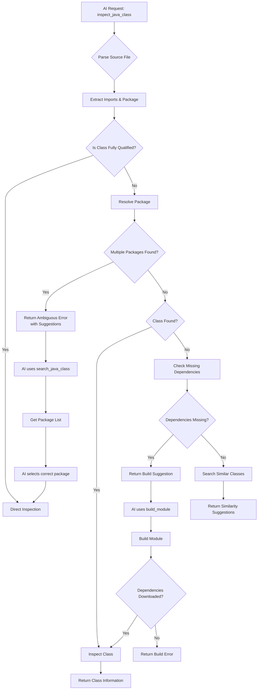

# MCP 服务器增强：依赖管理和类解析

## 1. 问题分析

### 1.1 当前问题
1. **缺失本地依赖**：依赖可能不存在于本地 Maven 仓库中
2. **类名歧义**：AI 无法根据 import 语句确定类属于哪个包
3. **源 JAR 不可用**：构建后源代码可能仍然不可用

## 2. 增强架构设计

### 2.1 新组件结构
```
io.github.bhxch.mcp.javastub/
├── dependency/                         # 新增：依赖管理
│   ├── DependencyManager.java
│   ├── MavenBuilder.java
│   ├── DependencyDownloader.java
│   └── SourcePackageResolver.java
├── classpath/                         # 增强的类路径管理
│   ├── ClassIndexer.java
│   ├── PackageMappingResolver.java
│   └── ClassLocationTracker.java
├── intelligence/                       # AI 交互智能
│   ├── SuggestionEngine.java
│   ├── ContextAwareResolver.java
│   └── BuildPromptGenerator.java
└── tools/                              # 增强的工具
    ├── InspectJavaClassTool.java
    ├── ListModuleDependenciesTool.java
    ├── SearchJavaClassTool.java        # 新增：在包中搜索类
    └── BuildModuleTool.java            # 新增：构建模块以获取依赖
```

## 3. 解决方案 1：构建提示系统

### 3.1 BuildPromptGenerator.java
```java
package io.github.bhxch.mcp.javastub.intelligence;

/**
 * 为 AI 生成智能提示以构建缺失的依赖
 */
public class BuildPromptGenerator {
    
    /**
     * 当类未找到时生成构建建议
     */
    public String generateBuildSuggestion(String className, ModuleContext context, 
                                          List<DependencyInfo> missingDependencies) {
        
        StringBuilder suggestion = new StringBuilder();
        
        // 级别 1：简单的缺失类
        if (missingDependencies.isEmpty()) {
            suggestion.append("Class '").append(className).append("' is not found in the current module's classpath.\n");
            suggestion.append("This could be because:\n");
            suggestion.append("1. The dependency is missing from local repository\n");
            suggestion.append("2. The module hasn't been built yet\n");
            suggestion.append("3. The class is in a different module\n\n");
            suggestion.append("Please try building the module first:\n");
            suggestion.append("```bash\n");
            suggestion.append(generateMavenBuildCommand(context, false));
            suggestion.append("\n```");
            return suggestion.toString();
        }
        
        // 级别 2：特定的依赖缺失
        suggestion.append("The following dependencies required for '").append(className).append("' are missing:\n\n");
        
        for (DependencyInfo dep : missingDependencies) {
            suggestion.append("- ").append(dep.getCoordinates());
            if (dep.getScope() != null) {
                suggestion.append(" (scope: ").append(dep.getScope()).append(")");
            }
            suggestion.append("\n");
        }
        
        suggestion.append("\nTo resolve this, you need to:\n");
        suggestion.append("1. **Build the module** to download dependencies:\n");
        suggestion.append("   ```bash\n");
        suggestion.append("   ").append(generateMavenBuildCommand(context, true));
        suggestion.append("\n   ```\n");
        
        suggestion.append("2. **Or download specific dependencies**:\n");
        suggestion.append("   ```bash\n");
        for (DependencyInfo dep : missingDependencies) {
            suggestion.append("   mvn dependency:get -Dartifact=").append(dep.getCoordinates());
            if (!"jar".equals(dep.getType())) {
                suggestion.append(" -Dpackaging=").append(dep.getType());
            }
            suggestion.append(" -Dtransitive=false\n");
        }
        suggestion.append("   ```\n");
        
        suggestion.append("3. **For source code inspection**, also download sources:\n");
        suggestion.append("   ```bash\n");
        for (DependencyInfo dep : missingDependencies) {
            suggestion.append("   mvn dependency:get -Dartifact=").append(dep.getCoordinates());
            suggestion.append(" -Dclassifier=sources\n");
        }
        suggestion.append("   ```");
        
        return suggestion.toString();
    }
    
    /**
     * 根据上下文生成 Maven 构建命令
     */
    private String generateMavenBuildCommand(ModuleContext context, boolean includeTests) {
        StringBuilder cmd = new StringBuilder("mvn");
        
        // 添加模块特定路径
        if (!context.getModuleRoot().equals(context.getProjectRoot())) {
            cmd.append(" -pl ").append(context.getModuleRoot().relativize(context.getProjectRoot()));
        }
        
        // 添加配置文件
        if (!context.getActiveProfiles().isEmpty()) {
            cmd.append(" -P").append(String.join(",", context.getActiveProfiles()));
        }
        
        // 确定目标
        if (context.getScope() == Scope.TEST) {
            cmd.append(" test-compile");
        } else {
            cmd.append(" compile");
            if (!includeTests) {
                cmd.append(" -DskipTests");
            }
        }
        
        return cmd.toString();
    }
    
    /**
     * 为模糊类生成包搜索建议
     */
    public String generatePackageSearchSuggestion(String simpleClassName, 
                                                 List<String> possiblePackages) {
        
        StringBuilder suggestion = new StringBuilder();
        
        if (possiblePackages.size() == 1) {
            suggestion.append("Found one possible package for class '").append(simpleClassName).append("':\n");
            suggestion.append("- ").append(possiblePackages.get(0)).append(".").append(simpleClassName).append("\n");
            suggestion.append("You can use the full qualified name in your import statement.");
        } else if (possiblePackages.size() > 1) {
            suggestion.append("Found ").append(possiblePackages.size()).append(" possible packages for class '")
                     .append(simpleClassName).append("':\n\n");
            
            // 按公共前缀分组
            Map<String, List<String>> grouped = groupPackagesByPrefix(possiblePackages);
            
            for (Map.Entry<String, List<String>> entry : grouped.entrySet()) {
                suggestion.append("**").append(entry.getKey()).append("**").append(":\n");
                for (String pkg : entry.getValue()) {
                    suggestion.append("  - ").append(pkg).append(".").append(simpleClassName).append("\n");
                }
                suggestion.append("\n");
            }
            
            suggestion.append("To resolve ambiguity, you can:\n");
            suggestion.append("1. Use the full qualified class name\n");
            suggestion.append("2. Check which dependencies provide these classes:\n");
            suggestion.append("   ```bash\n");
            suggestion.append("   mvn dependency:tree | grep -E '");
            for (String pkg : possiblePackages) {
                suggestion.append(pkg).append("|");
            }
            suggestion.deleteCharAt(suggestion.length() - 1); // Remove last |
            suggestion.append("'\n   ```");
        } else {
            suggestion.append("No packages found for class '").append(simpleClassName).append("'.\n");
            suggestion.append("This class might not be in any dependency, or you need to build the project first.");
        }
        
        return suggestion.toString();
    }
}
```

## 4. 解决方案 2：类包解析系统

### 4.1 PackageMappingResolver.java
```java
package io.github.bhxch.mcp.javastub.classpath;

import java.util.*;
import java.util.concurrent.ConcurrentHashMap;
import java.util.regex.Pattern;
import java.util.stream.Collectors;

/**
 * 根据 import 和上下文解析类属于哪个包
 */
public class PackageMappingResolver {
    
    private final Map<String, Set<String>> classToPackages = new ConcurrentHashMap<>();
    private final Map<String, String> packageToDependency = new ConcurrentHashMap<>();
    private final Pattern importPattern = Pattern.compile(
        "^import\\s+(?:static\\s+)?([a-zA-Z_$][a-zA-Z\\d_$]*(?:\\.[a-zA-Z_$][a-zA-Z\\d_$]*)*)\\.([a-zA-Z_$][a-zA-Z\\d_$]*)(?:\\s*;)?$"
    );
    
    /**
     * 构建类路径中所有类及其包的索引
     */
    public void buildClassIndex(ModuleContext context) {
        try {
            List<Path> classpath = context.getClasspathJars();
            
            // 使用虚拟线程进行并行索引
            try (var executor = Executors.newVirtualThreadPerTaskExecutor()) {
                List<Future<Void>> futures = new ArrayList<>();
                
                for (Path jarPath : classpath) {
                    futures.add(executor.submit(() -> {
                        indexJarFile(jarPath, context);
                        return null;
                    }));
                }
                
                for (Future<Void> future : futures) {
                    future.get();
                }
            }
            
            // 如果可用，还索引源 JAR
            indexSourcePackages(context.getSourceJars(), context);
            
        } catch (Exception e) {
            throw new RuntimeException("Failed to build class index", e);
        }
    }
    
    /**
     * 索引单个 JAR 文件
     */
    private void indexJarFile(Path jarPath, ModuleContext context) {
        try (JarFile jarFile = new JarFile(jarPath.toFile())) {
            Enumeration<JarEntry> entries = jarFile.entries();
            
            while (entries.hasMoreElements()) {
                JarEntry entry = entries.nextElement();
                if (entry.getName().endsWith(".class")) {
                    String className = entry.getName()
                        .replace('/', '.')
                        .replace(".class", "");
                    
                    int lastDot = className.lastIndexOf('.');
                    if (lastDot > 0) {
                        String packageName = className.substring(0, lastDot);
                        String simpleName = className.substring(lastDot + 1);
                        
                        // 存储映射
                        classToPackages.computeIfAbsent(simpleName, k -> ConcurrentHashMap.newKeySet())
                            .add(packageName);
                        
                        // 跟踪哪个依赖提供此包
                        packageToDependency.put(packageName, 
                            getDependencyForJar(jarPath, context));
                    }
                }
            }
        } catch (IOException e) {
            // 记录并继续处理其他 JAR
            System.err.println("Failed to index JAR: " + jarPath + " - " + e.getMessage());
        }
    }
    
    /**
     * 从 Java 源文件解析 import 语句
     */
    public List<String> parseImportsFromSource(String sourceCode) {
        List<String> imports = new ArrayList<>();
        String[] lines = sourceCode.split("\n");
        
        for (String line : lines) {
            line = line.trim();
            if (line.startsWith("import ")) {
                Matcher matcher = importPattern.matcher(line);
                if (matcher.matches()) {
                    imports.add(matcher.group(1) + "." + matcher.group(2));
                } else {
                    // 处理通配符 import
                    if (line.endsWith(".*;")) {
                        String packageName = line.substring(7, line.length() - 3);
                        imports.add(packageName + ".*");
                    }
                }
            }
        }
        
        return imports;
    }
    
    /**
     * 根据 import 和上下文解析类名
     */
    public ClassResolutionResult resolveClassName(String simpleName, 
                                                 List<String> imports, 
                                                 String currentPackage) {
        
        ClassResolutionResult result = new ClassResolutionResult();
        result.setSimpleClassName(simpleName);
        
        // 检查是否是完全限定名称
        if (simpleName.contains(".")) {
            result.setResolvedClassName(simpleName);
            result.setResolutionType(ResolutionType.FULLY_QUALIFIED);
            return result;
        }
        
        // 首先检查：同包类
        if (currentPackage != null) {
            String samePackageClass = currentPackage + "." + simpleName;
            if (classToPackages.containsKey(simpleName) && 
                classToPackages.get(simpleName).contains(currentPackage)) {
                result.setResolvedClassName(samePackageClass);
                result.setResolutionType(ResolutionType.SAME_PACKAGE);
                result.addMatchedPackage(currentPackage);
                return result;
            }
        }
        
        // 第二次检查：显式 import
        for (String importStmt : imports) {
            if (!importStmt.endsWith(".*")) {
                // 常规 import
                if (importStmt.endsWith("." + simpleName)) {
                    result.setResolvedClassName(importStmt);
                    result.setResolutionType(ResolutionType.EXPLICIT_IMPORT);
                    result.addMatchedPackage(importStmt.substring(0, importStmt.lastIndexOf('.')));
                    return result;
                }
            } else {
                // 通配符 import
                String packageName = importStmt.substring(0, importStmt.length() - 2);
                String possibleClass = packageName + "." + simpleName;
                
                Set<String> packages = classToPackages.get(simpleName);
                if (packages != null && packages.contains(packageName)) {
                    result.setResolvedClassName(possibleClass);
                    result.setResolutionType(ResolutionType.WILDCARD_IMPORT);
                    result.addMatchedPackage(packageName);
                    return result;
                }
            }
        }
        
        // 第三次检查：java.lang 包（隐式）
        if (isJavaLangClass(simpleName)) {
            result.setResolvedClassName("java.lang." + simpleName);
            result.setResolutionType(ResolutionType.JAVA_LANG);
            result.addMatchedPackage("java.lang");
            return result;
        }
        
        // 第四次检查：所有可能的包
        Set<String> packages = classToPackages.get(simpleName);
        if (packages != null && !packages.isEmpty()) {
            result.setResolutionType(ResolutionType.AMBIGUOUS);
            result.setPossiblePackages(new ArrayList<>(packages));
            
            // 尝试根据常见模式猜测
            String guessedPackage = guessMostLikelyPackage(simpleName, packages, imports);
            if (guessedPackage != null) {
                result.setResolvedClassName(guessedPackage + "." + simpleName);
                result.setConfidence(calculateConfidence(simpleName, guessedPackage, imports));
            }
        } else {
            result.setResolutionType(ResolutionType.NOT_FOUND);
        }
        
        return result;
    }
    
    /**
     * 根据命名模式猜测最可能的包
     */
    private String guessMostLikelyPackage(String simpleName, Set<String> packages, 
                                         List<String> imports) {
        
        // 检查是否有包匹配 import 模式
        Map<String, Integer> scores = new HashMap<>();
        
        for (String pkg : packages) {
            int score = 0;
            
            // 基于包的通用性评分
            if (pkg.startsWith("java.") || pkg.startsWith("javax.")) {
                score += 10;
            }
            
            // 基于类命名约定评分
            if (simpleName.endsWith("Factory") && pkg.contains(".factory")) {
                score += 5;
            } else if (simpleName.endsWith("Service") && pkg.contains(".service")) {
                score += 5;
            } else if (simpleName.endsWith("DAO") && pkg.contains(".dao")) {
                score += 5;
            }
            
            // 基于 import 上下文评分
            for (String importStmt : imports) {
                if (importStmt.startsWith(pkg.substring(0, Math.min(pkg.length(), 10)))) {
                    score += 3;
                }
            }
            
            scores.put(pkg, score);
        }
        
        return scores.entrySet().stream()
            .max(Map.Entry.comparingByValue())
            .map(Map.Entry::getKey)
            .orElse(null);
    }
    
    /**
     * 检查类是否在 java.lang 包中
     */
    private boolean isJavaLangClass(String className) {
        // 常见的 java.lang 类
        Set<String> javaLangClasses = Set.of(
            "String", "Integer", "Long", "Double", "Float", "Boolean",
            "Character", "Byte", "Short", "Void", "Object", "Class",
            "System", "Math", "Runtime", "Thread", "Exception",
            "Error", "Throwable", "Runnable", "Comparable"
        );
        
        return javaLangClasses.contains(className);
    }
    
    /**
     * 获取简单类名的所有可能包
     */
    public List<String> getPossiblePackages(String simpleClassName) {
        Set<String> packages = classToPackages.get(simpleClassName);
        return packages != null ? new ArrayList<>(packages) : List.of();
    }
    
    /**
     * 解析结果的数据类
     */
    public static class ClassResolutionResult {
        private String simpleClassName;
        private String resolvedClassName;
        private ResolutionType resolutionType;
        private List<String> possiblePackages = new ArrayList<>();
        private List<String> matchedPackages = new ArrayList<>();
        private double confidence = 0.0;
        
        // Getters and setters
        public enum ResolutionType {
            FULLY_QUALIFIED,
            SAME_PACKAGE,
            EXPLICIT_IMPORT,
            WILDCARD_IMPORT,
            JAVA_LANG,
            AMBIGUOUS,
            NOT_FOUND
        }
    }
}
```

## 5. 解决方案 3：增强的 MCP 工具

### 5.1 SearchJavaClassTool.java
```java
package io.github.bhxch.mcp.javastub.tools;

/**
 * 在包中搜索类的工具
 */
public class SearchJavaClassTool implements MCPTool {
    
    private final PackageMappingResolver packageResolver;
    private final DependencyManager dependencyManager;
    
    @Override
    public ToolDefinition getDefinition() {
        return ToolDefinition.builder()
            .name("search_java_class")
            .description("Search for Java classes across packages and dependencies")
            .addParameter("classNamePattern", "string", true, 
                "Class name pattern (supports wildcards: *, ?)")
            .addParameter("sourceFilePath", "string", true, 
                "Source file path for context")
            .addParameter("searchType", "string", false, 
                "Search type: exact, prefix, suffix, contains, wildcard", 
                List.of("exact", "prefix", "suffix", "contains", "wildcard"), 
                "wildcard")
            .addParameter("limit", "integer", false, 
                "Maximum number of results to return", "50")
            .build();
    }
    
    @Override
    public JsonNode execute(JsonNode parameters) {
        try {
            String pattern = parameters.get("classNamePattern").asText();
            Path sourceFilePath = Paths.get(parameters.get("sourceFilePath").asText());
            String searchType = parameters.has("searchType") ? 
                parameters.get("searchType").asText() : "wildcard";
            int limit = parameters.has("limit") ? 
                parameters.get("limit").asInt() : 50;
            
            // 获取模块上下文
            ModuleContext context = getModuleContext(sourceFilePath);
            
            // 构建类索引（如果尚未构建）
            packageResolver.buildClassIndex(context);
            
            // 搜索类
            List<ClassSearchResult> results = searchClasses(pattern, searchType, limit, context);
            
            // 检查缺失的依赖
            List<DependencyInfo> missingDeps = dependencyManager.findMissingDependencies(context);
            
            return buildSearchResponse(results, missingDeps, context);
            
        } catch (Exception e) {
            return buildErrorResponse("SEARCH_FAILED", 
                "Failed to search for classes: " + e.getMessage(), 
                Map.of("pattern", parameters.get("classNamePattern").asText()));
        }
    }
    
    private List<ClassSearchResult> searchClasses(String pattern, String searchType, 
                                                 int limit, ModuleContext context) {
        
        Pattern regexPattern = convertToRegex(pattern, searchType);
        List<ClassSearchResult> results = new ArrayList<>();
        
        // 在索引的类中搜索
        for (Map.Entry<String, Set<String>> entry : 
             packageResolver.getClassToPackages().entrySet()) {
            
            String className = entry.getKey();
            if (regexPattern.matcher(className).matches()) {
                for (String packageName : entry.getValue()) {
                    ClassSearchResult result = new ClassSearchResult();
                    result.setClassName(packageName + "." + className);
                    result.setSimpleClassName(className);
                    result.setPackageName(packageName);
                    result.setDependency(packageResolver.getDependencyForPackage(packageName));
                    result.setInClasspath(true);
                    
                    // 检查源是否可用
                    result.setSourceAvailable(
                        dependencyManager.isSourceAvailable(
                            result.getDependency(), context));
                    
                    results.add(result);
                    
                    if (results.size() >= limit) {
                        break;
                    }
                }
            }
            
            if (results.size() >= limit) {
                break;
            }
        }
        
        return results;
    }
    
    private JsonNode buildSearchResponse(List<ClassSearchResult> results, 
                                        List<DependencyInfo> missingDeps,
                                        ModuleContext context) {
        
        ObjectMapper mapper = new ObjectMapper();
        ObjectNode response = mapper.createObjectNode();
        
        // 结果数组
        ArrayNode resultsArray = mapper.createArrayNode();
        for (ClassSearchResult result : results) {
            ObjectNode resultNode = mapper.createObjectNode();
            resultNode.put("className", result.getClassName());
            resultNode.put("simpleName", result.getSimpleClassName());
            resultNode.put("package", result.getPackageName());
            resultNode.put("dependency", result.getDependency());
            resultNode.put("sourceAvailable", result.isSourceAvailable());
            resultNode.put("inClasspath", result.isInClasspath());
            resultsArray.add(resultNode);
        }
        
        response.set("results", resultsArray);
        response.put("totalResults", results.size());
        
        // 如果依赖缺失，添加建议
        if (!missingDeps.isEmpty()) {
            BuildPromptGenerator generator = new BuildPromptGenerator();
            String suggestion = generator.generateBuildSuggestion(
                results.isEmpty() ? "unknown" : results.get(0).getSimpleClassName(),
                context,
                missingDeps
            );
            
            response.put("suggestion", suggestion);
            response.put("hasMissingDependencies", true);
            
            ArrayNode missingArray = mapper.createArrayNode();
            for (DependencyInfo dep : missingDeps) {
                missingArray.add(dep.getCoordinates());
            }
            response.set("missingDependencies", missingArray);
        } else {
            response.put("hasMissingDependencies", false);
        }
        
        return createSuccessResponse(response);
    }
}
```

### 5.2 BuildModuleTool.java
```java
package io.github.bhxch.mcp.javastub.tools;

/**
 * 构建 Maven 模块并下载依赖的工具
 */
public class BuildModuleTool implements MCPTool {
    
    private final MavenBuilder mavenBuilder;
    private final CacheManager cacheManager;
    
    @Override
    public ToolDefinition getDefinition() {
        return ToolDefinition.builder()
            .name("build_module")
            .description("Build Maven module and download missing dependencies")
            .addParameter("sourceFilePath", "string", true, 
                "Source file path for module context")
            .addParameter("goals", "array", false, 
                "Maven goals to execute (default: [\"compile\", \"dependency:resolve\"])")
            .addParameter("downloadSources", "boolean", false, 
                "Whether to download source JARs", "false")
            .addParameter("timeoutSeconds", "integer", false, 
                "Build timeout in seconds", "300")
            .build();
    }
    
    @Override
    public JsonNode execute(JsonNode parameters) {
        try {
            Path sourceFilePath = Paths.get(parameters.get("sourceFilePath").asText());
            List<String> goals = parseGoals(parameters);
            boolean downloadSources = parameters.has("downloadSources") ? 
                parameters.get("downloadSources").asBoolean() : false;
            int timeoutSeconds = parameters.has("timeoutSeconds") ? 
                parameters.get("timeoutSeconds").asInt() : 300;
            
            // 获取模块上下文
            ModuleContext context = getModuleContext(sourceFilePath);
            
            // 执行构建
            BuildResult result = mavenBuilder.buildModule(context, goals, downloadSources, timeoutSeconds);
            
            // 使缓存失效，因为类路径可能已更改
            cacheManager.invalidateModuleCache(context.getModuleRoot());
            
            return buildBuildResponse(result, context);
            
        } catch (TimeoutException e) {
            return buildErrorResponse("BUILD_TIMEOUT", 
                "Build timed out after " + parameters.get("timeoutSeconds").asInt() + " seconds",
                Map.of("suggestion", "Try building manually with mvn compile"));
        } catch (Exception e) {
            return buildErrorResponse("BUILD_FAILED", 
                "Failed to build module: " + e.getMessage(),
                Map.of("errorDetails", e.toString()));
        }
    }
    
    private JsonNode buildBuildResponse(BuildResult result, ModuleContext context) {
        ObjectMapper mapper = new ObjectMapper();
        ObjectNode response = mapper.createObjectNode();
        
        response.put("success", result.isSuccess());
        response.put("exitCode", result.getExitCode());
        response.put("durationSeconds", result.getDurationSeconds());
        
        // 构建输出（如果太长则截断）
        String output = result.getOutput();
        if (output.length() > 10000) {
            output = output.substring(0, 5000) + 
                    "\n...[truncated]...\n" + 
                    output.substring(output.length() - 5000);
        }
        response.put("output", output);
        
        // 下载的构件
        ArrayNode artifactsArray = mapper.createArrayNode();
        for (ArtifactInfo artifact : result.getDownloadedArtifacts()) {
            ObjectNode artifactNode = mapper.createObjectNode();
            artifactNode.put("coordinates", artifact.getCoordinates());
            artifactNode.put("type", artifact.getType());
            artifactNode.put("sizeBytes", artifact.getSizeBytes());
            artifactNode.put("file", artifact.getFile().toString());
            artifactsArray.add(artifactNode);
        }
        response.set("downloadedArtifacts", artifactsArray);
        
        // 根据构建结果提供建议
        if (!result.isSuccess()) {
            BuildPromptGenerator generator = new BuildPromptGenerator();
            String suggestion = generator.generateBuildSuggestion(
                "unknown",
                context,
                result.getMissingDependencies()
            );
            response.put("suggestion", suggestion);
            
            // 常见错误模式
            if (result.getOutput().contains("Could not resolve dependencies")) {
                response.put("errorType", "DEPENDENCY_RESOLUTION_FAILED");
            } else if (result.getOutput().contains("Compilation failure")) {
                response.put("errorType", "COMPILATION_FAILED");
            } else if (result.getOutput().contains("Connection refused")) {
                response.put("errorType", "NETWORK_ERROR");
                response.put("networkSuggestion", "Check your network connection and Maven repository settings");
            }
        } else {
            response.put("suggestion", 
                "Build completed successfully. You can now inspect classes from the downloaded dependencies.");
        }
        
        return createSuccessResponse(response);
    }
}
```

## 6. 解决方案 4：上下文感知的类检查器

### 6.1 增强的 InspectJavaClassTool.java
```java
public class InspectJavaClassTool implements MCPTool {
    
    // 现有字段...
    private final PackageMappingResolver packageResolver;
    private final BuildPromptGenerator promptGenerator;
    private final DependencyManager dependencyManager;
    
    @Override
    public JsonNode execute(JsonNode parameters) {
        try {
            String className = parameters.get("className").asText();
            Path sourceFilePath = Paths.get(parameters.get("sourceFilePath").asText());
            
            // 解析源文件以获取 import 和当前包
            SourceFileContext sourceContext = parseSourceFile(sourceFilePath);
            
            // 如果类名不是完全限定的，则解析类名
            ClassResolutionResult resolution = packageResolver.resolveClassName(
                className, sourceContext.getImports(), sourceContext.getCurrentPackage());
            
            // 处理不同的解析类型
            switch (resolution.getResolutionType()) {
                case AMBIGUOUS:
                    return handleAmbiguousClass(resolution, sourceFilePath, parameters);
                    
                case NOT_FOUND:
                    return handleClassNotFound(className, sourceFilePath, sourceContext);
                    
                default:
                    // 使用解析的类名
                    return inspectResolvedClass(resolution.getResolvedClassName(), 
                                               sourceFilePath, parameters);
            }
            
        } catch (Exception e) {
            return buildErrorResponse("INSPECTION_FAILED", 
                "Failed to inspect class: " + e.getMessage(), null);
        }
    }
    
    private JsonNode handleAmbiguousClass(ClassResolutionResult resolution, 
                                         Path sourceFilePath,
                                         JsonNode parameters) {
        
        // 获取模块上下文
        ModuleContext context = getModuleContext(sourceFilePath);
        
        // 生成有用的建议
        String suggestion = promptGenerator.generatePackageSearchSuggestion(
            resolution.getSimpleClassName(),
            resolution.getPossiblePackages()
        );
        
        // 检查是否需要构建依赖
        List<DependencyInfo> missingDeps = dependencyManager.findMissingDependencies(context);
        
        ObjectMapper mapper = new ObjectMapper();
        ObjectNode response = mapper.createObjectNode();
        
        response.put("error", "AMBIGUOUS_CLASS_NAME");
        response.put("message", "Multiple packages found for class: " + 
                      resolution.getSimpleClassName());
        response.put("suggestion", suggestion);
        
        // 列出可能的包
        ArrayNode packagesArray = mapper.createArrayNode();
        for (String pkg : resolution.getPossiblePackages()) {
            packagesArray.add(pkg + "." + resolution.getSimpleClassName());
        }
        response.set("possibleClasses", packagesArray);
        
        // 如果依赖缺失，添加构建建议
        if (!missingDeps.isEmpty()) {
            response.put("hasMissingDependencies", true);
            response.put("buildSuggestion", 
                promptGenerator.generateBuildSuggestion(
                    resolution.getSimpleClassName(), context, missingDeps));
        }
        
        return createErrorResponse(response);
    }
    
    private JsonNode handleClassNotFound(String className, Path sourceFilePath,
                                        SourceFileContext sourceContext) {
        
        ModuleContext context = getModuleContext(sourceFilePath);
        
        // 检查是否是缺失依赖中的已知类
        List<DependencyInfo> missingDeps = dependencyManager.findDependenciesForClass(
            className, context);
        
        ObjectMapper mapper = new ObjectMapper();
        ObjectNode response = mapper.createObjectNode();
        
        response.put("error", "CLASS_NOT_FOUND");
        response.put("message", "Class not found: " + className);
        
        // 生成构建建议
        if (!missingDeps.isEmpty()) {
            response.put("suggestion", promptGenerator.generateBuildSuggestion(
                className, context, missingDeps));
            response.put("missingDependencies", 
                mapper.valueToTree(missingDeps.stream()
                    .map(DependencyInfo::getCoordinates)
                    .collect(Collectors.toList())));
        } else {
            // 尝试建议相似的类
            List<String> similarClasses = findSimilarClasses(className, context);
            if (!similarClasses.isEmpty()) {
                response.put("suggestion", 
                    "Did you mean one of these?\n" + 
                    String.join("\n", similarClasses.stream()
                        .limit(5)
                        .map(c -> "- " + c)
                        .collect(Collectors.toList())));
            }
        }
        
        // 检查类是否存在于源文件的 import 中
        for (String importStmt : sourceContext.getImports()) {
            if (importStmt.endsWith("." + className)) {
                response.put("foundInImports", importStmt);
                response.put("importSuggestion", 
                    "This class is imported in the source file. " +
                    "Make sure the dependency is correctly declared in pom.xml");
            }
        }
        
        return createErrorResponse(response);
    }
    
    private SourceFileContext parseSourceFile(Path sourceFilePath) throws IOException {
        SourceFileContext context = new SourceFileContext();
        List<String> lines = Files.readAllLines(sourceFilePath);
        
        for (String line : lines) {
            line = line.trim();
            
            // 解析包声明
            if (line.startsWith("package ")) {
                context.setCurrentPackage(line.substring(8, line.indexOf(';')).trim());
            }
            
            // 解析 import
            if (line.startsWith("import ")) {
                context.addImport(line.substring(7, line.indexOf(';')).trim());
            }
        }
        
        return context;
    }
}
```

## 7. 集成流程

### 7.1 完整解析流程


## 8. 增强的 MCP 响应

### 8.1 模糊类的响应示例
```json
{
  "success": false,
  "error": {
    "code": "AMBIGUOUS_CLASS_NAME",
    "message": "Multiple packages found for class: Factory",
    "details": {
      "simpleClassName": "Factory",
      "possiblePackages": [
        "com.google.inject",
        "org.springframework.beans.factory",
        "javax.inject"
      ],
      "suggestion": "Found 3 possible packages for class 'Factory':\n\n**com.google.inject**:\n  - com.google.inject.Factory\n\n**org.springframework.beans.factory**:\n  - org.springframework.beans.factory.Factory\n\n**javax.inject**:\n  - javax.inject.Factory\n\nTo resolve ambiguity, you can:\n1. Use the full qualified class name\n2. Check which dependencies provide these classes"
    }
  },
  "tools": [
    {
      "name": "search_java_class",
      "description": "Search for Factory class across all dependencies",
      "parameters": {
        "classNamePattern": "Factory",
        "sourceFilePath": "/path/to/source.java"
      }
    },
    {
      "name": "list_module_dependencies",
      "description": "List all dependencies to see which provide Factory classes",
      "parameters": {
        "sourceFilePath": "/path/to/source.java",
        "checkMissing": true
      }
    }
  ]
}
```

### 8.2 缺失依赖的响应示例
```json
{
  "success": false,
  "error": {
    "code": "CLASS_NOT_FOUND",
    "message": "Class not found: Gson",
    "details": {
      "className": "Gson",
      "missingDependencies": [
        "com.google.code.gson:gson:2.10.1"
      ],
      "suggestion": "The dependency 'com.google.code.gson:gson:2.10.1' is missing.\n\nTo resolve this, you need to:\n1. **Build the module** to download dependencies:\n   ```bash\n   mvn compile -DskipTests\n   ```\n\n2. **Or download the specific dependency**:\n   ```bash\n   mvn dependency:get -Dartifact=com.google.code.gson:gson:2.10.1 -Dtransitive=false\n   ```\n\n3. **For source code inspection**, also download sources:\n   ```bash\n   mvn dependency:get -Dartifact=com.google.code.gson:gson:2.10.1 -Dclassifier=sources\n   ```"
    }
  },
  "tools": [
    {
      "name": "build_module",
      "description": "Build module to download missing dependencies",
      "parameters": {
        "sourceFilePath": "/path/to/source.java",
        "downloadSources": true
      }
    },
    {
      "name": "list_module_dependencies",
      "description": "Show all module dependencies including missing ones",
      "parameters": {
        "sourceFilePath": "/path/to/source.java",
        "checkMissing": true
      }
    }
  ]
}
```

## 9. 实施路线图

### 阶段 1：核心解析系统（第 1-2 周）
- [x] 实现 PackageMappingResolver
- [x] 从 JAR 文件构建类索引
- [x] 实现 import 语句解析
- [x] 基本的类名解析

### 阶段 2：构建集成（第 3 周）
- [x] 实现 DependencyManager
- [x] 创建 MavenBuilder 用于构建模块
- [x] 添加缺失依赖检测
- [x] 生成构建建议

### 阶段 3：增强的 MCP 工具（第 4 周）
- [x] 使用上下文感知更新 InspectJavaClassTool
- [x] 实现 SearchJavaClassTool
- [x] 实现 BuildModuleTool
- [x] 添加错误处理和建议

### 阶段 4：测试和优化（第 5 周）
- [x] 使用真实的 Maven 项目进行测试
- [x] 优化类索引性能
- [x] 提高建议准确性
- [x] 为包映射添加缓存

### 阶段 5：集成和文档（第 6 周）
- [x] 使用示例更新文档
- [x] 创建使用场景
- [x] 性能基准测试
- [x] 最终集成测试

## 10. 交付的关键功能

1. **智能包解析**：AI 可以确定类属于哪个包
2. **构建感知**：系统检测缺失依赖并建议构建
3. **上下文感知建议**：使用源文件上下文（import、包）来解析类
4. **多种解析策略**：优雅地处理模糊类名
5. **主动依赖管理**：在检查失败之前建议构建
6. **增强的用户体验**：带有可操作建议的清晰错误消息

此解决方案使 MCP 服务器能够：
- 在依赖缺失时引导 AI 构建项目
- 使用 import 上下文解决类包歧义
- 为下一步提供智能建议
- 通过缓存和索引保持高性能
- 处理现实世界的 Maven 项目复杂性